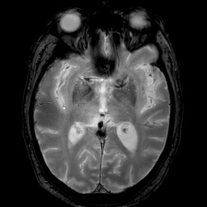
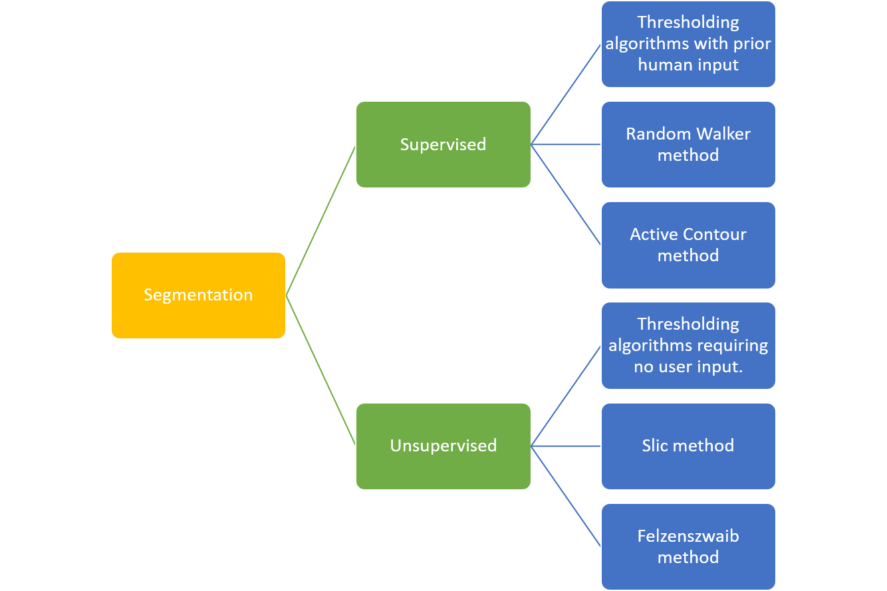
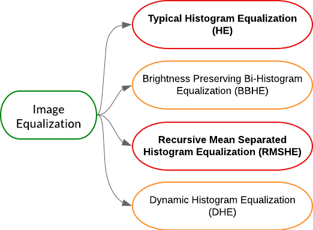
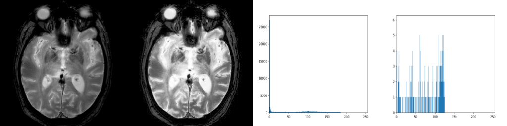

# MRI-brain-images-dataset-preprocessing
Magnetic Resonance Imaging (MRI) of the brain is one of the most prevalent image acquisitions performed in the diagnostic centers and hospitals. The acquisition of a brain MRI scan is noninvasive and nondestructive. It involves yielding an arbitrary cross‐section of the brain without radiation exposure.

Brain MRIs demonstrate superior soft‐tissue contrast, high spatial resolution, and reveal the detailed anatomical structures of brains.

The aim of this project, is to know how to improve the quality of MRI brain images by preprocessing them and prepare the dataset for Machine Learning &amp; Data Mining process.

  

# Preprocessing steps

-----------------------------------------------------------------------------------------------------------------------------------------------------------------------

### 1. Standardize images by resizing them
- The idea here is to iterate all the images in our dataset using **os.listdir()**, this function returns the list of files and subdirectories present in the given directory.
- Than, for each each image read with **Image.open** function, we resize it using **resize** function of an **Image** object from **PIL** library
- We store all the resized images in **./resized** folder

-----------------------------------------------------------------------------------------------------------------------------------------------------------------------

### 2. Brain Tissue segmentation (Brain extraction) [[Paper link]](https://www.researchgate.net/publication/339708961_Conventional_and_Deep_Learning_Methods_for_Skull_Stripping_in_Brain_MRI)
- The inclusion of non‐brain tissue parts in brain region like (skull, dura mater,etc.) can lead to incorrect decision making
- Thus, brain segmentation, also recognized as brain extraction or skull stripping is a critical step for a neuroimaging diagnostic system
- Now let's talk a little bit about **Image Segmentation**

  #### 2.1. Image Segmentation [[Medium article]](https://towardsdatascience.com/image-segmentation-using-pythons-scikit-image-module-533a61ecc980)
  - Image Segmentation is essentially the process of partitioning a digital image into multiple segments to simplify and/or change the representation of an image into something that is more meaningful and easier to analyze.
  - There are two approaches for image segmentation
  - The first one is the **Supervised Segmentation**, where some prior knowledge, possibly from human input, is used to guide the algorithm.
  - The second approch is the **Unsupervised Segmentation**, where no prior knowledge is required. These algorithms attempt to subdivide images into meaningful regions automatically. The user may still be able to tweak certain settings to obtain desired outputs.
  
  

-----------------------------------------------------------------------------------------------------------------------------------------------------------------------

### 3. Image Histogram equalization (HE) [[Paper link]](https://arxiv.org/ftp/arxiv/papers/2003/2003.06615.pdf)
- MRI brain images are low contrast images which make diagnoses difficult, hence better localization of image pixels is required. 
- Histogram Equalization techniques help to enhance the image so that it gives an improved visual quality and a well defined problem. The contrast and brightness is enhanced in such a way that it does not lose its original information and the brightness is preserved.
- Through my research, I learned that there are **4 main** approaches for Image Histogram Equalization (all approches are explained in paper linked)

  

- In this project, I was interested in two different approaches to implement, the first one, a simple implementation by **OpenCV** library based on **Typical Histogram Equalization** technique, and the second approach will talk about **RMSHE : Recursive Mean Separated Histogram Equalization** 

  #### 3.1. HE : Typical Histogram Equalization (performed by cv2.equalizeHist()) [[article link]](https://opencv24-python-tutorials.readthedocs.io/en/latest/py_tutorials/py_imgproc/py_histograms/py_histogram_equalization/py_histogram_equalization.html) 
  - OpenCV has a function to do HE called **cv2.equalizeHist()**
  - This method usually increases the global contrast of many images to get an enhanced output, especially when the usable data of the image is represented by close contrast values.
  - The function equalizes the histogram of the input image using the following algorithm:
    - Calculate the histogram.
    - Normalize the histogram so that the sum of histogram bins is 255.
    - Compute the integral of the histogram.
    - Transform the image using
    - The algorithm normalizes the brightness and increases the contrast of the image.
  - In the exmple below, I performed a Typical Histogram Equalization on an MRI brain image 

  

- **HE** approach equalizes the intensity values to full range of the histogram to get an enhanced output. It increases the brightness and contrast of each pixel giving rise to dynamic range expansion
- **But**, it does not consider the mean brightness of the input image into account, will gives rise to flattening of the output image histogram, false coloring, annoying artifacts in background, unnatural enhancement, excessive change in brightness, most importantly decreasing the contrast and no brightness preservation.
- To solve that, I needed to partition the input picture histogram into multiple sub-parts using the average intensity of the pixels.
- More precisely, I did it **Recusively => RMSHE**.

  #### 3.2. RMSHE : Recursive Mean Separated Histogram Equalization

-----------------------------------------------------------------------------------------------------------------------------------------------------------------------

### 4. Splitting dataset (trainset - testset) 

