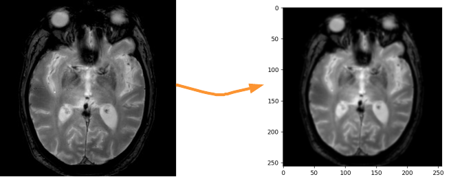
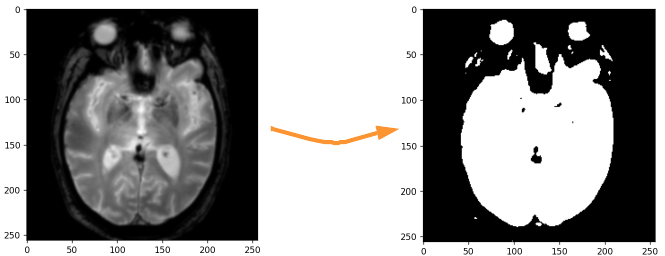
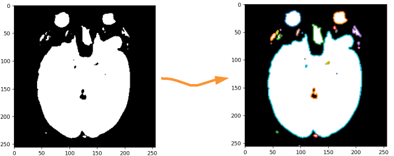
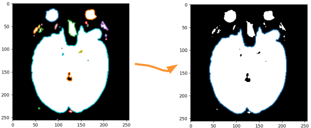
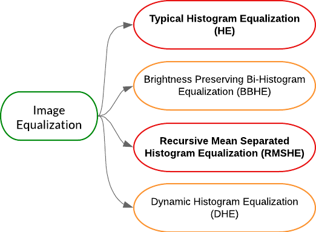
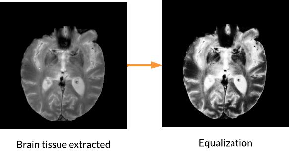

# MRI-brain-images-dataset-preprocessing
Magnetic Resonance Imaging (MRI) of the brain is one of the most prevalent image acquisitions performed in the diagnostic centers and hospitals. The acquisition of a brain MRI scan is noninvasive and nondestructive. It involves yielding an arbitrary cross‐section of the brain without radiation exposure.

Brain MRIs demonstrate superior soft‐tissue contrast, high spatial resolution, and reveal the detailed anatomical structures of brains.

The aim of this project, is to know how to improve the quality of MRI brain images by preprocessing them and prepare the dataset for Machine Learning &amp; Data Mining process.

  

# Preprocessing steps

-----------------------------------------------------------------------------------------------------------------------------------------------------------------------

### 1. Standardize images by resizing them
- The idea here is to iterate all the images in our dataset using **os.listdir()**, this function returns the list of files and subdirectories present in the given directory.
- Than, for each each image read with **Image.open** function, we resize it using **resize** function of an **Image** object from **PIL** library
- We store all the resized images in **./resized** folder

-----------------------------------------------------------------------------------------------------------------------------------------------------------------------

### 2. Brain Tissue segmentation (Brain extraction) [[Article link]](https://www.hindawi.com/journals/ijbi/2017/9749108/)
- The inclusion of non‐brain tissue parts in brain region like (skull, dura mater,etc.) can lead to incorrect decision making. Thus, brain segmentation, also recognized as brain extraction or skull stripping is a critical step for a neuroimaging diagnostic system.
- Brain tissue segmentation from MRI images, isn't that easy to implement... I've read a good article talking about [Image Analysis for MRI Based Brain Tumor Detection and Feature Extraction](https://www.hindawi.com/journals/ijbi/2017/9749108/), where the author explained the steps of **Skull Stripping** process.

  

- Based on these Skull stripping steps, I made my own steps for **Brain Extraction from MRI images** :

  

  #### 2.1. Convert image to grayscale & blur the image to denoise 

  

  #### 2.2. Convert image to binary image (black : 0, white : 1) by tresholding
  - Use a treshold to specify which pixel range will represent the value of 0 (black pixel) and which pixel range will represent the value of 1 (white pixel)

  

  #### 2.3. Find contours of all the objects on the image

  

  #### 2.4. Find the longest contour (because it represents the brain contour)

  

  #### 2.5. Create the brain mask

  

  #### 2.6. Apply the brain mask on the original image to extract brain from it

  

  #### The idea behind the fifth step (Creating the Brain Mask) :
  - Is to split our image of (256px, 256px) into four parts (based on the center of the image coordinates (128,128)) as shown in the following example:

  

  - Then for each point (x,y) of the outline of the brain, take each point (x',y') of our image where it is located in the brain tissue (without crossing the contours) as explained below:

  

  - Finally, we create the brain mask:

  

  

-----------------------------------------------------------------------------------------------------------------------------------------------------------------------

### 3. Image Histogram equalization (HE) [[Paper link]](https://arxiv.org/ftp/arxiv/papers/2003/2003.06615.pdf)
- MRI brain images are low contrast images which make diagnoses difficult, hence better localization of image pixels is required. 
- Histogram Equalization techniques help to enhance the image so that it gives an improved visual quality and a well defined problem. The contrast and brightness is enhanced in such a way that it does not lose its original information and the brightness is preserved.
- Through my research, I learned that there are **4 main** approaches for Image Histogram Equalization (all approches are explained in paper linked)

  

- In this project, I was interested in two different approaches to implement, the first one, a simple implementation by **OpenCV** library based on **Typical Histogram Equalization** technique, and the second approach will talk about **RMSHE : Recursive Mean Separated Histogram Equalization** 

  #### 3.1. HE : Typical Histogram Equalization (performed by cv2.equalizeHist()) [[Article link]](https://opencv24-python-tutorials.readthedocs.io/en/latest/py_tutorials/py_imgproc/py_histograms/py_histogram_equalization/py_histogram_equalization.html) 
  - OpenCV has a function to do HE called **cv2.equalizeHist()**
  - This method usually increases the global contrast of many images to get an enhanced output, especially when the usable data of the image is represented by close contrast values.
  - The function equalizes the histogram of the input image using the following algorithm:
    - Calculate the histogram.
    - Normalize the histogram so that the sum of histogram bins is 255.
    - Compute the integral of the histogram.
    - Transform the image using
    - The algorithm normalizes the brightness and increases the contrast of the image.
  - In the exmple below, I performed a Typical Histogram Equalization on an MRI brain image 

  

- **HE** approach equalizes the intensity values to full range of the histogram to get an enhanced output. It increases the brightness and contrast of each pixel giving rise to dynamic range expansion
- **But**, it does not consider the mean brightness of the input image into account, will gives rise to flattening of the output image histogram, false coloring, annoying artifacts in background, unnatural enhancement, excessive change in brightness, most importantly decreasing the contrast and no brightness preservation.
- To solve that, I needed to partition the input picture histogram into multiple sub-parts using the average intensity of the pixels.
- More precisely, I did it **Recusively => RMSHE**.

  #### 3.2. RMSHE : Recursive Mean Separated Histogram Equalization

-----------------------------------------------------------------------------------------------------------------------------------------------------------------------

### 4. Gamma Correction [[Article link]](https://lindevs.com/apply-gamma-correction-to-an-image-using-opencv)
- Cerebral Brain MRI images contain parts that can look either too light or too dark. Gamma correction is a method that allows us to control the brightness of an image. The formula used to get a gamma corrected image is given below:

  

- Where I : is the input pixel value [0, 255]
- O : is the output pixel value [0, 255]
- Gamma that controls image brightness:
  - Gamme < 1 => the image will be darker
  - Gamma > 1 => the image will be lighter
  - Gamma = 1 => no effect

- I implemented Gamma correction using lookup table (LUT) from OpenCV, which performs a lookup table transform, example :

  

-----------------------------------------------------------------------------------------------------------------------------------------------------------------------

### 5. Splitting dataset (trainset - valset - testset) : using the [[splitfolders library]](https://pypi.org/project/split-folders/) 

